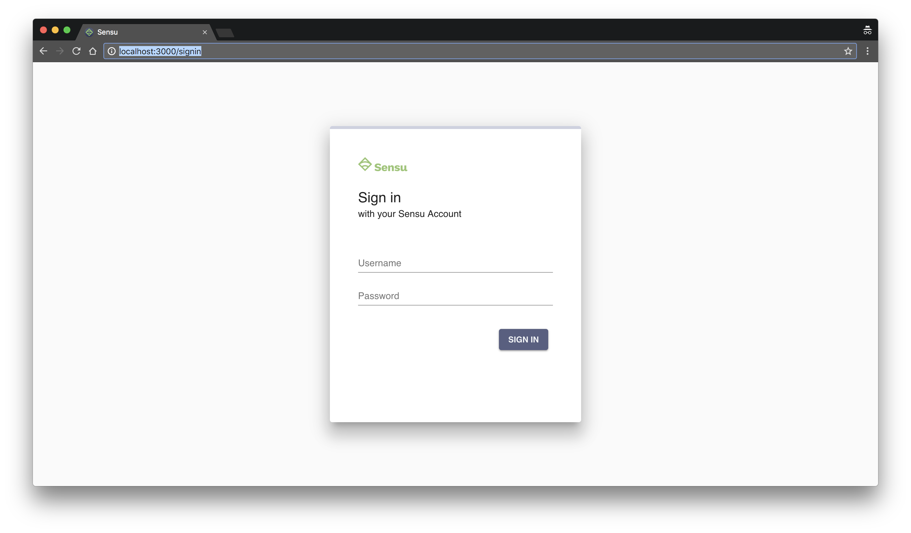

# Sensu Go Demo

This project was originally created to show how to quickly setup a local Sensu
Go environment using Docker Compose. It includes an Asset server and telemetry
pipeline for a more complete development workflow.

_NOTE: Since the time this project was started (during the beta and initial GA
releases of Sensu Go) the [Sensu website][homepage] has been updated with a simpler "quick
start" guide, which is a better place to get started for most users._

[homepage]: https://sensu.io/#getting-started

## Workshop contents

1. A `docker-compose.yaml` for provisioning a simple Sensu Go demo environment,
   including:
   - A Sensu Go backend, API, and dashboard (`sensu-backend`)
   - A Sensu Go agent (`sensu-agent`)
   - An HTTP file server for hosting [Sensu Assets][1]
   - A telemetry stack (InfluxDB for storage & Grafana for visualization)
2. Configuration files for NGINX, InfluxDB, and Grafana
3. Sensu resource configuration templates (e.g. asset and check definitions)

[1]: https://docs.sensu.io/sensu-go/latest/reference/assets/

## Prerequisites

You'll need a working Docker environment with Docker Compose to run this demo.
If you're using a Mac, head on over to the [Docker CE for Mac][2] page for more
instructions. Linux users can find installation instructions from the [Docker CE
installation guide][3].

[2]: https://store.docker.com/editions/community/docker-ce-desktop-mac
[3]: https://docs.docker.com/install/

## Workshop

1. Bootstrap our Sensu Go environment!

   ```
   $ docker-compose up -d
   Creating network "sensu-go-demo_default" with the default driver
   Creating volume "sensu-go-demo_sensu-backend-data" with local driver
   Creating volume "sensu-go-demo_influxdb-data" with local driver
   Creating sensu-go-demo_sensu-backend_1 ... done
   Creating sensu-go-demo_sensu-agent_1        ... done
   Creating sensu-go-demo_sensu-asset-server_1 ... done
   Creating sensu-go-demo_influxdb_1           ... done
   Creating sensu-go-demo_grafana_1            ... done
   ```

   _NOTE: you may see some `docker pull` and `docker build` output on your first
   run as Docker pulls down our base images and builds a few custom images._

   Once `docker-compose` is done standing up our systems we should be able to
   login to the Sensu Go dashboard!

   

   _NOTE: you may login to the dashboard using the default username and password
   for a fresh Sensu Go installation; username: `admin` and password:
   `P@ssw0rd!`._

2. Install and configure a local `sensuctl` (the new Sensu Go CLI)

   Mac users:

   ```
   $ curl -LO https://s3-us-west-2.amazonaws.com/sensu.io/sensu-go/5.15.0/sensu-go_5.15.0_darwin_amd64.tar.gz
   $ sudo tar -xzf sensu-go_5.15.0_darwin_amd64.tar.gz -C /usr/local/bin/
   ```

   Linux and Windows users can find [`sensuctl` installation instructions
   here][4]. The complete list of Sensu downloads is available at
   https://sensu.io/downloads

   Configure `sensuctl`:

   ```
   $ sensuctl configure -n --url http://127.0.0.1:8080 \
     --username admin \
     --password 'P@ssw0rd!' \
     --namespace default
   ```

   Alternatively, you may configure `sensuctl` using the interactive mode:

   ```
   $ sensuctl configure

   ? Sensu Backend URL: (http://localhost:8080)
   ? Username: admin
   ? Password: *********
   ? Organization: default
   ? Environment: default
   ? Preferred output format: tabular
   ```

   _NOTE: the default username and password for a fresh Sensu Go installation
   are username: `admin` and password: `P@ssw0rd!`._

   [4]: https://docs.sensu.io/sensu-go/latest/installation/install-sensu/#install-sensuctl

3. Register some Sensu Go Assets from [Bonsai][5] (i.e. the "Docker Hub" for
   Sensu Go plugins):

   ```
   $ sensuctl asset add sensu/monitoring-plugins:2.2.0-2
   $ sensuctl asset add sensu/sensu-influxdb-handler
   ```

   [5]: https://bonsai.sensu.io

4. Configure a handler to process your monitoring data:

   ```
   $ sensuctl create -f manifests/handlers/influxdb.yaml
   ```

5. Configure a check to start collecting data:

   ```
   $ sensuctl create -f manifests/checks/example-http-service-check.yaml
   ```

## Helpful tips

### Local HTTP server for hosting Sensu Assets

This project provides a local HTTP server for hosting Sensu Assets. This will
allow you to test new assets by dropping them into the `./assets` directory. You
can view your assets from your browser by visiting http://localhost:8000/assets.
To view the HTTP server logs, simply use `docker logs` to follow the NGINX
container logs:

```
$ docker logs -f $(docker ps --format "{{.ID}}" --filter "name=sensu-asset-server")

172.28.0.1 - - [23/Aug/2018:22:15:30 +0000] "GET /assets/ HTTP/1.1" 200 955 "-" "Mozilla/5.0 (Macintosh; Intel Mac OS X 10_13_6) AppleWebKit/537.36 (KHTML, like Gecko) Chrome/68.0.3440.106 Safari/537.36"
```

An example "helloworld-0.1.0.tar.gz" asset has been provided to demonstrate this
workflow. To register this example asset, and configure a check to use the
example asset, run the following commands:

```shell
$ sensuctl create -f manifests/assets/helloworld.yaml
$ sensuctl create -f manifests/checks/helloworld.yaml
```

For reference, this is what an asset definition looks like:

```yaml
---
type: Asset
api_version: core/v2
metadata:
  name: helloworld:0.1.0
spec:
  url: http://sensu-asset-server/assets/helloworld-0.1.0.tar.gz
  sha512: 8d18d3194b94330155b004d516d4164593e40030ac80813eb3e6ba14d5f2570ed59508148890a7b0d6200148c1c0cff7cd161a26ca624aa2c8f7fc31caa3556c
  filters:
  - "entity.system.os == 'linux'"
```

_NOTE: the "sensu-asset-server" host name used here will be automatically
resolved by Docker for communication between containers (specifically from the
sensu-agent container to the NGINX container). This same container is accessible
from your host OS at 127.0.0.1:8080, as Docker is "publishing" port 8080 of your
local workstation to the NGINX container port 80. See Docker's ["Container
Networking"][6] documentation for more information._

[6]: https://docs.docker.com/config/containers/container-networking/

### Interact with the Sensu API

The [Sensu Go API][api], like the rest of Sensu Go, provides full support for
role-based access controls (RBAC). This also means that an authentication token
is required to make API calls. As of version 5.13.0, the Sensu CLI provides a
helpful [`sensuctl env` command][7] for setting local environment variables,
including a `SENSU_ACCESS_TOKEN` which can be used to make API calls.

```
$ eval $(sensuctl env)
```

Example API requests:

- `GET /api/core/v2/namespaces/$SENSU_NAMESPACE/entities`
- `GET /api/core/v2/namespaces/$SENSU_NAMESPACE/assets`
- `GET /api/core/v2/namespaces/$SENSU_NAMESPACE/checks`
- `GET /api/core/v2/namespaces/$SENSU_NAMESPACE/handlers`

Example `POST /entities` for registering proxy entities in Sensu Go:

```
$ curl -XPOST -s -H "Authorization: $SENSU_ACCESS_TOKEN" -H "Content-Type: application/json" -d '{"id": "web-server-01", "class": "proxy", "environment": "default", "organization": "default", "extended_attributes": {"foo": "bar"}, "keepalive_timeout": 30}' http://localhost:8080/entities
```

[7]: https://docs.sensu.io/sensu-go/latest/sensuctl/reference/#environment-variables
